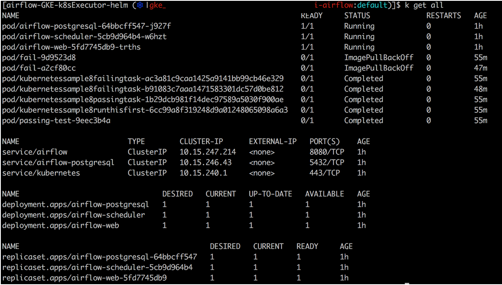

# Cost-effective, scalable and stateless airflow

Deploy a highly-available, auto-scaling, stateless airflow cluster with the kubernetes executor and CloudSQL. This also includes an SSL airflow admin page, google Oauth2 login, Cloud Filestore for storing dags and logs and can be completed in under 20 minutes. The monthly fixed cost is approximately $180 at the cheapest to $500/month for a HA version (default installation shown here, $240/month Cloud Filestore minimum), plus $0.015 per vCPU hour <https://cloud.google.com/products/calculator/#id=22a2fecd-fc97-412f-8560-1ce1f70bb44f>:

  Cheapest:

* $30/month for pre-emptible scheduler/web server node
* $30/month for single node NFS
* $70/month for 1 core CloudSQL instance
* $50/month for logs and storage

  Cost per CPU Hour:

* Auto-scaling, pre-emptible `n1-highcpu-4` cost of $30/month, or $40/month assuming 75% utilisation.
* $40/(730 hours per month * 4 vCPU) = $0.015/vCPU hour

This calculation assumes you have idempotent dags, for non-idempotent dags the cost is circa $0.05/vCPU hour. This compares with approximately $300 + $0.20/(vCPU + DB)hour with Cloud Composer <https://cloud.google.com/composer/pricing>. This tutorial installs on the free Google account ($300 over 12 months). Elasticsearch and Grafana/Prometheus can additionally be installed in a further 10 minutes to view airflow logs and metrics, see [Monitoring and Logging](#Monitoring-and-Logging) (this is an additional circa $100/month for the compute resources).

## Installation instructions



Pre-requisites:

* Ensure you have helm (v2.9.1), kubectl (v1.11.0), openssl, gcloud SDK (v208.0.1)
* Ensure the Cloud SQL Admin API has been enabled on your project (<https://cloud.google.com/sql/docs/mysql/admin-api/>)

Installation instructions:

```bash
git clone https://github.com/EamonKeane/airflow-GKE-k8sExecutor-helm.git
cd airflow-GKE-k8sExecutor-helm
```

The following script is for GKE and by default installs:
(for installing on azure see [AKS](#AKS))

* A HA postgres CloudSql instance along with cloudsql service account, airflow database and password
* A 3-zone regional kubernetes cluster
* An auto-scaling worker pool for dag tasks (starts at zero, take 2 minutes to spin up when first dag is triggered)
* A kubernetes secret containing the sql_alchemy_conn, fernet key, gcs-log-folder name, cloudsql service account and the cluster's kubeconfig (for the Kube Pod Operator with local executor)
* A Cloud Filestore instance

```bash
# NOTE cloud filestore is only available in the following areas, so choose another region as necessary if your currently configured region is not listed
# asia-eas1, europe-west1, europe-west3, europe-west4, us-central1
# us-east1, us-west1, us-west2
ACCOUNT=$(gcloud config get-value core/account)
PROJECT=$(gcloud config get-value core/project)
REGION=$(gcloud config get-value compute/region)
GCE_ZONE=$(gcloud config get-value compute/zone)
DATABASE_INSTANCE_NAME=airflow
CLOUD_FILESTORE_ZONE=$(gcloud config get-value compute/region)
HIGHLY_AVAILABLE=TRUE
./gcloud-sql-k8s-install.sh \
    --project=$PROJECT \
    --account=$ACCOUNT \
    --gce-zone=$GCE_ZONE \
    --region=$REGION \
    --database-instance-name=$DATABASE_INSTANCE_NAME \
    --cloud-filestore-zone=$CLOUD_FILESTORE_ZONE \
    --highly-available=$HIGHLY_AVAILABLE
```

```bash
CLOUD_FILESTORE_IP=$(gcloud beta filestore instances describe airflow \
                                      --project=$PROJECT \
                                      --location=$CLOUD_FILESTORE_ZONE \
                                      --format json | jq .networks[0].ipAddresses[0] --raw-output)
```

For airflow to be able to write to Cloud Filestore, you need to change the permissions on the NFS(<https://cloud.google.com/filestore/docs/quickstart-console>).
Follow the instructions below [Cloud Filestore Permissions](#Setting-file-permissions-on-Cloud-Filestore):

If not using Cloud Filestore, see below for the installation instructions for installing a Google Cloud [NFS Server](#NFS-Server).

# Setting file permissions on Cloud Filestore

Create a VM to mount the file share and make the required changes.

```bash
VM_NAME=change-permissions
gcloud compute --project=$PROJECT instances create $VM_NAME --zone=$GCE_ZONE
```

SSH into the machine

```bash
gcloud compute ssh $VM_NAME --zone=$GCE_ZONE --project=$PROJECT
```

Copy and paste the following into the terminal:

```bash
sudo apt-get -y update
sudo apt-get -y install nfs-common
```

Then copy and paste the following (substituting your `$CLOUD_FILESTORE_IP` for the ip address):

```bash
CLOUD_FILESTORE_IP=
sudo mkdir /mnt/test
sudo mount $CLOUD_FILESTORE_IP:/airflow /mnt/test
sudo mkdir /mnt/test/dags
sudo mkdir /mnt/test/logs
sudo chmod go+rw /mnt/test/dags
sudo chmod go+rw /mnt/test/logs
```

Then delete the VM:

```bash
gcloud compute instances delete $VM_NAME --zone=$GCE_ZONE --project=$PROJECT
```

## Install the helm chart

```bash
helm upgrade \
    --install \
    --set google.project=$PROJECT \
    --set google.region=$REGION \
    --set dagVolume.nfsServer=$CLOUD_FILESTORE_IP \
    --set logVolume.nfsServer=$CLOUD_FILESTORE_IP \
    airflow \
    airflow
```

You can change `airflow/airflow.cfg` and re-run the above `helm upgrade --install` command to redeploy the changes. This takes approximately 30 seconds.

Quickly copy the example dags folder here to the NFS by using `kubectl cp`:

```bash
NAMESPACE=default
GIT_FOLDER_ROOT=/Users/Eamon/kubernetes
DAGS_FOLDER_LOCAL=airflow-GKE-k8sExecutor-helm/dags
DAGS_FOLDER_REMOTE=/usr/local/airflow/dags
export POD_NAME=$(kubectl get pods --namespace $NAMESPACE -l "app=airflow,tier=scheduler" -o jsonpath="{.items[0].metadata.name}")
kubectl cp $GIT_FOLDER_ROOT/$DAGS_FOLDER_LOCAL/ $NAMESPACE/$POD_NAME:$DAGS_FOLDER_REMOTE
```

Alternatively run the script below:

```bash
./scripts/copy-dags-to-nfs.sh
```

View the dashboard using the instructions below and you should see the examples in the dags folder of this repo.

```bash
export POD_NAME=$(kubectl get pods --namespace default -l "app=airflow,tier=web" -o jsonpath="{.items[0].metadata.name}")
echo "Visit http://127.0.0.1:8080 to use your application"
kubectl port-forward $POD_NAME 8080:8080
```

To expose the web server behind a https url with google oauth, set `webScheduler.web.authenticate` to `True` and see the section for google-oauth, cert-manager and nginx-ingress install instructions [SSL UI](#Exposing-oauth2-Google-ingress-with-cert-manager-and-nginx-ingress).

## Tidying up

The easiest way to tidy-up is to delete the project and make a new one if re-deploying, however there are steps in `tidying-up.sh` to delete the individual resources.
For azure you can simply `az group delete --resource-group $RESOURCE_GROUP` to delete everything.

## Helm chart layout

There are a few elements to the chart:

* This chart only focuses on the kubernetes executor and is tailored to run on GKE, but with some effort could be modified to run on premise or EKS/AKS.
* Google Cloud Filestore (beta - equivalent of EFS and AFS on AWS and Azure respectively). You need to populate this separately using e.g. Jenkins (see sample jenkins file and instructions below [Jenkins](#Setup-Jenkins-to-sync-dags)).
* Pre-install hooks add the airflow-RBAC account, dags/logs PV, dags/logs PVC and CloudSQL service. If the step fails at this point, you will need to remove everything before running helm again. See `tidying-up.sh` for details.
* Pre-install and pre-upgrade hook to run the alembic migrations
* Separate, templated airflow.cfg a change of which triggers a redeployment of both the web scheduler and the web server. This is due to the name of the configmap being appended with the current seconds (-{{ .Release.Time.Seconds }}) so a new configmap gets deployed each time. You may want to delete old configmaps from time to time.

## Debugging

When debugging it is useful to set the executor to LocalExecutor. This can be done by the following:

```bash
--set airflowCfg.core.executor=LocalExecutor
```

If the installation is giving you trouble, running a pod inside the cluster can be helpful. This can be done e.g. by:

```bash
kubectl run airflow-test --rm -it --image quay.io/eamonkeane/airflow-k8s:0.5-oracle --command /bin/bash
```

This way you can see all the logs on one pod and can still test kubernetes using the Pod Operator (this requires a kubeconfig to be mounted on the scheduler pod, which is part of the setup).

To view the applied configuration, shell into a pod and paste the following code:

```python
python
from airflow.configuration import *
from pprint import pprint
pprint(conf.as_dict(display_source=True,display_sensitive=True))
```

## Exposing oauth2 Google ingress with cert-manager and nginx-ingress

```bash
helm install stable/cert-manager \
    --name cert-manager \
    --namespace kube-system \
    --set ingressShim.defaultIssuerName=letsencrypt-prod \
    --set ingressShim.defaultIssuerKind=ClusterIssuer
```

Add the default cluster issuer (this will install an let's encrypt cert using the below letsencrypt-prod certificate issuer for all). Replace the email field with your email.

```bash
cat <<EOF | kubectl create -f -
apiVersion: certmanager.k8s.io/v1alpha1
kind: ClusterIssuer
metadata:
  name: letsencrypt-prod
spec:
  acme:
    server: https://acme-v02.api.letsencrypt.org/directory
    email: mydomain@logistio.ie
    privateKeySecretRef:
      name: letsencrypt-prod
    http01: {}
EOF
```

Install nginx-ingress with the option to preserve sticky sessions (externalTrafficPolicy). This will take around a minute to install.

```bash
helm install stable/nginx-ingress \
    --wait \
    --name nginx-ingress \
    --namespace kube-system \
    --set rbac.create=true \
    --set controller.service.externalTrafficPolicy=Local
```

```bash
INGRESS_IP=$(kubectl get svc \
            --namespace kube-system \
            --selector=app=nginx-ingress,component=controller \
            -o jsonpath='{.items[0].status.loadBalancer.ingress[0].ip}');echo ${INGRESS_IP}
```

Add a DNS A record of `$MY_AIRFLOW_DOMAIN` with IP address `$INGRESS_IP` with your domain name provider. Verify that it has updated.

```bash
dig $MY_AIRFLOW_DOMAIN
...
;; ANSWER SECTION:
airflow.mysite.io. 5      IN      A       35.230.155.177
...
```

Create a file called `my-values.yaml` using `my-values.example.yaml` template and populate it with the values below.

```bash
MY_AIRFLOW_DOMAIN=airflow.mysite.io
```

```yaml
ingress:
  enabled: true
  hosts:
    - $MY_DOMAIN
  tls:
  - hosts:
    - $MY_DOMAIN
    secretName: $MY_DOMAIN
```

Create an oauth2 credential on Google Cloud Dashboard.

```bash
PROJECT=myorg-123456
OAUTH_APP_NAME=myorg-airflow
```

* Navigate to <https://console.cloud.google.com/apis/credentials?project=$PROJECT>
* Click Create Credentials
* Select OAuth Client ID
* Select Web Application
* Enter `$OAUTH_APP_NAME` as the Name
* In authorized redirect URLs, enter <https://$MY_DOMAIN/oauth2callback>
* Click download json at the top of the page

Get the file path of the json file:

```bash
MY_OAUTH2_CREDENTIALS=...client_secret_123456778910-oul980h2fk7om2o67aj5d0aum79pqv8a.apps.googleusercontent.com.json
```

Create a kubernetes secret to hold the client_id and client_secret (these will be set as env variables in the web pod)

```bash
CLIENT_ID=$(jq .web.client_id $MY_OAUTH2_CREDENTIALS --raw-output )
CLIENT_SECRET=$(jq .web.client_secret $MY_OAUTH2_CREDENTIALS --raw-output )
kubectl create secret generic google-oauth \
        --from-literal=client_id=$CLIENT_ID \
        --from-literal=client_secret=$CLIENT_SECRET
```

Add the below values to `my-values.yaml`:

```yaml
webScheduler:
  web:
    authenticate: True
    authBackend: airflow.contrib.auth.backends.google_auth
    googleAuthDomain: mysite.io
    googleAuthSecret: google-oauth
    googleAuthSecretClientIDKey: client_id
    googleAuthSecretClientSecretKey: client_secret
```

Update the helm deployment.

```bash
helm upgrade \
    --install \
    --set google.project=$PROJECT \
    --set google.region=$REGION \
    --values my-values.yaml \
    airflow \
    airflow
```

Navigate to `https://$MY_AIRFLOW_DOMAIN`. Log into google, you should now see the dashboard UI.


## Setup Jenkins to sync dags

```bash
jq ".nfs.name = \"$AIRFLOW_NFS_VM_NAME\"" Jenkinsfile.json > tmp.json && mv tmp.json Jenkinsfile.json
jq ".nfs.internalIP = \"$INTERNAL_IP\"" Jenkinsfile.json > tmp.json && mv tmp.json Jenkinsfile.json
jq ".nfs.dagFolder = \"$STORAGE_NAME\"" Jenkinsfile.json > tmp.json && mv tmp.json Jenkinsfile.json
jq ".nfs.zone = \"$GCE_ZONE\"" Jenkinsfile.json > tmp.json && mv tmp.json Jenkinsfile.json
```

In the Jenkinsfile pod template, replace `nfsVolume` variables to the following:

```bash
serverAddress: $INTERNAL_IP
serverPath: $STORAGE_NAME
```

Set up Jenkins to trigger a build on each git push of this repository (see here for example instructions: <https://github.com/eamonkeane/jenkins-blue>). The dags folder will then appear synced in your webscheduler pods.  

## NFS Server

```bash
NFS_DEPLOYMENT_NAME=airflow
NFS_ZONE=$GCE_ZONE
NFS_INSTANCE_NAME=myorg-airflow
STORAGE_NAME=airflow
```

* Navigate to: <https://console.cloud.google.com/launcher/details/click-to-deploy-images/singlefs?q=nfs&project=$PROJECT>
* Click `LAUNCH ON COMPUTE ENGINE`
* Enter `NFS_DEPLOYMENT` name as the deployment name
* Enter `NFS_ZONE`  as the zone
* Change the machine type to 1vCPU (this is sufficient)
* Enter instance name as $INSTANCE_NAME
* Leave the nfs folder as data unless you want to change it
* Change the disk to SSD
* Change the storage disk size to 10GB (or more if you have a lot of dags)
* Change the filesystem to ext4
* Click deploy

Update your `my-values.yaml` with the below block:

Get the internal IP address of your instance:

```bash
AIRFLOW_NFS_VM_NAME=$NFS_DEPLOYMENT_NAME-vm

INTERNAL_IP=$(gcloud compute instances describe $AIRFLOW_NFS_VM_NAME \
                --zone=$NFS_ZONE \
                --format='value(networkInterfaces[0].networkIP)')
```

```yaml
dagVolume:
  nfsServer: "$INTERNAL_IP"
  nfsPath: "/$STORAGE_NAME"
```

Setup jenkins per the instructions [below](#Setup-Jenkins-to-sync-dags), or alternatively, copy the example pod operator in this repo to the $STORAGE_NAME of the NFS server (you can get connection instructions at this url <https://console.cloud.google.com/dm/deployments/details/$NFS_DEPLOYMENT_NAME?project=$PROJECT>)

## Monitoring and Logging

For effortless (and free) monitoring and logging, use the Google Click to Deploy to GKE apps. This will trigger the autoscaling worker pool to scale up to meet the demands. The only cost is the additional persistent disks and the nodes (approximately two `n1-highcpu-4` nodes).

### Elasticsearch

* Follow the (very simple) instructions at:

<https://marketplace.gcr.io/google/elastic-gke-logging>

To view airflow logs substitute the `namespace` and `app instance name` what you entered on the previous page:

```bash
ELASTICSEARCH_APP_INSTANCE_NAME=elastic-gke-logging-1-kibana-svc
ELASTICSEARCH_DEPLOYMENT_NAMESPACE=cluster-monitoring
KIBANA_PORT=5601
```

* Open a webpage:

```bash
kubectl port-forward $ELASTICSEARCH_APP_INSTANCE_NAME svc/ -n $ELASTICSEARCH_DEPLOYMENT_NAMESPACE $KIBANA_PORT
open http://localhost:$KIBANA_PORT/
```

* Select `OPEN` at the top of the page
* Select `GKE Apps Logs`
* You will then see something similar to the below (this is because of the annotation `app.kubernetes.io/name: airflow` added to each of the deployment objects (<https://kubernetes.io/docs/concepts/overview/working-with-objects/common-labels/>).


### Prometheus and Grafana

* Follow the (very simple) instructions at:

https://marketplace.gcr.io/google/prometheus

To view the grafana dashboard:

```bash
GRAF_PROM_APP_INSTANCE_NAME=prometheus-1
GRAF_PROM_DEPLOYMENT_NAMESPACE=cluster-monitoring
GRAFANA_PORT=3000
```

* Open a webpage:

```bash
kubectl port-forward --namespace $GRAF_PROM_DEPLOYMENT_NAMESPACE $GRAF_PROM_APP_INSTANCE_NAME $GRAFANA_PORT
open http://localhost:$GRAFANA_PORT/
```

* Enter the following username and password:

```bash
USERNAME=admin
PASSWORD=

kubectl get secret $GRAF_PROM_APP_INSTANCE_NAME-grafana \
                   --namespace=$GRAF_PROM_DEPLOYMENT_NAMESPACE \
                  -o jsonpath='{.data.admin-password}' \
                     | base64 --decode | pbcopy
```

* Click `Home` and explore some of the sample dashboards e.g. `K8s/ Compute Resources/ Cluster`


## Notes

### Deleting pod operators

To delete kubernetes pod operators which have completed run:

```bash
NAMESPACE=default
kubectl delete pods --namespace $NAMESPACE --field-selector=status.phase=Succeeded
```

A dag to delete successfully completed pod operators is available in:

```bash
./dags/delete_successful_pod_operators.py
```

### Resetting scheduler

To reset the scheduler database run the following commands:

```bash
NAMESPACE=default
export POD_NAME=$(kubectl get pods --namespace $NAMESPACE -l "app=airflow,tier=scheduler" -o jsonpath="{.items[0].metadata.name}")
kubectl exec -it --namespace $NAMESPACE $POD_NAME -- airflow resetdb
```

Then delete the scheduler pod to restart:

```bash
kubectl delete pod --namespace $NAMESPACE $POD_NAME
```

### Scaling

The kubernetes executor requires one connection per concurrent task. The limits for CloudSQL are quite low and cannot be changed except by increasing memory. In practical terms this means that for the smallest instance you can only get 90 connections (100 connections minus 6 reserved for CloudSQL internal operations minus the webserver and scheduler). Ensure that `airflowCfg.core.dagConcurrency` is set below this limit, or else you will notice pods failing.

<https://stackoverflow.com/questions/51084907/how-to-increase-the-connection-limit-for-the-google-cloud-sql-postgres-database>


The default limit for pods per node is 30 when using the Azure Kubernetes Service advanced networking plugin (required for VNET for postgres). After the 10 system pods, this would limit you to 10 concurrent tasks per node (one for k8s executor, one for pod operator).

## AKS

The following script installs:

* A resource group
* A VNET for the cluster
* A three-node cluster `Standard_DS2_v2` (2 vCPU, 7GiB). Advanced networking is enabled VNET between managed postgres
* A storage account for dags and logs
* An Azure managed postgresql 10 database along with airflow username/pwd and airflow database. SSL is enforced and this connection is managed with the Balitmore root cert in the container and located at /usr/local/airflow/.postgresql/root.crt
* Enables Microsoft.SQL service endpoint on the VNET so postgres can connect
* Create a VNET rule so that postgres accepts connections from the cluster
* A kubernetes secret containing: fernet-key, sql-alchemy-conn and kubeconfig

The script takes roughly 30 minutes to complete as it waits for resources to be provisioned.

```bash
RESOURCE_GROUP=$(openssl rand -base64 10 | tr -dc 'a-z0-9-._()')
LOCATION=westeurope
STORAGE_ACCOUNT_NAME=$(openssl rand -base64 24 | tr -dc 'a-z0-9')
POSTGRES_DATABASE_INSTANCE_NAME=$(openssl rand -base64 8 | tr -dc 'a-z0-9')
NODE_VM_SIZE=Standard_DS2_v2
NODE_COUNT=3
AIRFLOW_NAMESPACE=default
./aks-sql-k8s-install.sh \
  --resource-group=$RESOURCE_GROUP \
  --location=$LOCATION \
  --storage-account-name=$STORAGE_ACCOUNT_NAME \
  --postgres-database-instance-name=$POSTGRES_DATABASE_INSTANCE_NAME \
  --node-vm-size=$NODE_VM_SIZE \
  --node-count=$NODE_COUNT \
  --airflow-namespace=$AIRFLOW_NAMESPACE
```

```bash
helm upgrade \
    --install \
    --set google.enabled=False \
    --set azure.enabled=True \
    --set azure.location=$LOCATION \
    --set azure.storageAccountName=$STORAGE_ACCOUNT_NAME \
    --set namespace=$AIRFLOW_NAMESPACE \
    airflow \
    airflow
```

## Install locally

```bash
AIRFLOW_NAMESPACE=airflow

kubectl create namespace $AIRFLOW_NAMESPACE

AIRFLOW_DATABASE_USER=airflow
POSTGRES_ADMIN_PASSWORD=airflow
AIRFLOW_DATABASE_NAME=airflow
POSTGRES_SERVICE=airflow-postgres-postgresql
POSTGRES_PORT=5432
AIRFLOW_DATABASE_USER_PASSWORD=airflow

KUBECONFIG_FILE_OUTPUT=kubeconfig

helm upgrade \
    --install \
    airflow-postgres \
    stable/postgresql \
    --version 0.15.0 \
    --namespace $AIRFLOW_NAMESPACE \
    --set postgresPassword=$POSTGRES_ADMIN_PASSWORD \
    --set postgresUser=$AIRFLOW_DATABASE_USER \
    --set postgresDatabase=$AIRFLOW_DATABASE_USER_PASSWORD

SQL_ALCHEMY_CONN=postgresql+psycopg2://$AIRFLOW_DATABASE_USER:$AIRFLOW_DATABASE_USER_PASSWORD@$POSTGRES_SERVICE:$POSTGRES_PORT/$AIRFLOW_DATABASE_NAME

FERNET_KEY=tpiIe17JmQ8slUcYBlHDLFEkgXkSAkLOP3wAdl+5s+4=

cat <<EOF > kubeconfig
apiVersion: v1
clusters:
- cluster:
    insecure-skip-tls-verify: true
    server: https://localhost:6443
  name: docker-for-desktop-cluster
current-context: docker-for-desktop
kind: Config
preferences: {}
users:
- name: docker-for-desktop
  user:
    client-certificate-data: LS0tLS1CRUdJTiBDRVJUSUZJQ0FURS0tLS0tCk1JSUM5RENDQWR5Z0F3SUJBZ0lJRlRxQytBTW9tUVF3RFFZSktvWklodmNOQVFFTEJRQXdGVEVUTUJFR0ExVUUKQXhNS2EzVmlaWEp1WlhSbGN6QWVGdzB4T0RBNE1EUXdPVEE1TlRWYUZ3MHhPVEE0TVRReE5ESTRNalphTURZeApGekFWQmdOVkJBb1REbk41YzNSbGJUcHRZWE4wWlhKek1Sc3dHUVlEVlFRREV4SmtiMk5yWlhJdFptOXlMV1JsCmMydDBiM0F3Z2dFaU1BMEdDU3FHU0liM0RRRUJBUVVBQTRJQkR3QXdnZ0VLQW9JQkFRREhPNi9Rb1pXQlAzTVYKN1ZlZ0NKZSsyK1NqRTJJR3VCbnpBU3RLcmVCSEIxUjcvcm1NbCsyVDU4RmNFVkgxUmUrVXNwYXhpdVZFR2ptOApYS2VrWWtYNmpOZXpPcm1CSkZWcy9xZ2NLOXdTNi92Z0MvSmFTU2tiSnUxRnZPQlZtZVcxWjhkajRwL0FLNTg5ClVvRzlhZ0RHQTUyWVJsUVpaNSt5Y2NienRtNmY1Vy9PZUpGb0h3UGRsUWVqNmRxRll2a1RSMVlEQ2dNTks4WXQKUUU2NzMyMis2ZXREUTNEOHJxSlJlTjl6MGdjS1RKWkNZbC94Mk1MTDNyeHp3amdHRkp2ejJxci9CRGtNK0MyRgo5b1dOZ0pqd01FZWR2UCtYbjNzdngxZG8vZkM2ak90dmQrMkNQU0g4eDVCc3A2MzNkY0lxUExGc2xta1NWaitmCmsvb3RIU1Q3QWdNQkFBR2pKekFsTUE0R0ExVWREd0VCL3dRRUF3SUZvREFUQmdOVkhTVUVEREFLQmdnckJnRUYKQlFjREFqQU5CZ2txaGtpRzl3MEJBUXNGQUFPQ0FRRUFKYlk1SFhnWlNQODRaOVhrNGpudWdiWWZuOEk5VUFOKwpsODUxdDV2ZFNLVWdXbjZWcitoa3A5cW1lRVJQYkUwaXJrZHZ3TjJuOHRod0tVTlAzYkI3Qy90TXJyWTFWQVhrCnB4MUZhQzdCT094Z2RxblJpOUE3SWxjdkl5cS83eVpoSWFNNUE1ZitldVQrOXlzdnk0Z3Z6OG4veVN0WnA1QUEKZzA5bks0dGRzVjBOaktlMmorWkFLSzNEd3RQa1dNS2UxcGF0RHo2cFBTUllveXpPMVpLcnU4NlZEeFgxbWxXNApOYWk4ZWNGV2hwVUZzK1JlL2REejljTDNkUDYwNUlzTEhzQlgyam1jYk9PczFsVFJmWlNlbDQxdk1rcE5EVVhqCkhmY3lGZGgrSGprbG5LcjNIaTJCb2taM3ArM1ZaejRNVWJPWURFYTd6YmJzRE40QUF4eUdXZz09Ci0tLS0tRU5EIENFUlRJRklDQVRFLS0tLS0K
    client-key-data: LS0tLS1CRUdJTiBSU0EgUFJJVkFURSBLRVktLS0tLQpNSUlFb3dJQkFBS0NBUUVBeHp1djBLR1ZnVDl6RmUxWG9BaVh2dHZrb3hOaUJyZ1o4d0VyU3EzZ1J3ZFVlLzY1CmpKZnRrK2ZCWEJGUjlVWHZsTEtXc1lybFJCbzV2RnlucEdKRitvelhzenE1Z1NSVmJQNm9IQ3ZjRXV2NzRBdnkKV2trcEd5YnRSYnpnVlpubHRXZkhZK0tmd0N1ZlBWS0J2V29BeGdPZG1FWlVHV2Vmc25IRzg3WnVuK1Z2em5pUgphQjhEM1pVSG8rbmFoV0w1RTBkV0F3b0REU3ZHTFVCT3U5OXR2dW5yUTBOdy9LNmlVWGpmYzlJSENreVdRbUpmCjhkakN5OTY4YzhJNEJoU2I4OXFxL3dRNURQZ3RoZmFGallDWThEQkhuYnovbDU5N0w4ZFhhUDN3dW96cmIzZnQKZ2owaC9NZVFiS2V0OTNYQ0tqeXhiSlpwRWxZL241UDZMUjBrK3dJREFRQUJBb0lCQUVLTHV5UFNkTjlnMUEzawo0cm0vWlFBSTdvdFJ0QkpPZDh4ay9aTEtGUGxraDJHTEtXcStiRXBVeEk3OThnUWN3Zk5HMjNLZDFBbzFRRWVjCkl4cVRBSkM1Ym1xZEdNejcxOVM2RW1pbWRiR1VST01HMm9JeG9adENHMHFKMWR5QnRPb3NxYnJCUFY2d3MxV0cKTTNPUzdvTTFQZlJZdVVwckJEcFVLb0hJMDVad010cUp1UkpCMUl0TDMvWXNZUFpZcFRwRXdKWVZLd3d5QXppVgp4RG9HZ29BNzcxYjN0MUlTMTVOSTQxOWFzNEVRVUJrNUJDdW5URlJWUVplclArUmN4RkZMSlk2emxkZ2NIYlpXClprUXhyYTR1WWFsMVR2THByVWF6YlAzUlFGRkJmalpoR2JBWktYM2V1Y1lCT1dTSTM2M2h1QmE3dVJzZ3lWaDUKc3hVSjNWRUNnWUVBOUhrUDM2c2hqbWl0K0Q4QTIyU09kRnJOQmRRbXc4NW9ERzJSQ3FZV3N2a2ZNbEpObU5oNApHczVEN1VXQllWZytISXkzakZwdlJlOTdLWFJXVkpoSXppOXdYUVBlZ2dla3FqL0RkM2tpSkZ1TUJ4NHNuRHRMCkpIRU5JYWdEbWtjcnFsRjNLUytreU1UK2daRDhqenUySHBIc1pSWHliQVJrbzBLOWNRNWNQUDBDZ1lFQTBLQ04Kb1pPQ2QyNTlLUTFWME1MczJVTjduUEEweXl0dXFnWWZidS82VHozWWt2Z2c3TG9SbWVVMFFwR0NnUVgxRzRCZgpZT2R2TWV5NFJPT0g5ZzAyWWZDc3ZxYWdoeGxUS2YyU3ZDOTBjWEt6MU5CcEtLeGlqcnhKWWJ3NkdLd3lGV2RFCmVxMk1NTS9XMExuL3dEM3VzbEpXdXc5VDRYZlVnaXpDa09aM2gxY0NnWUJQWlZIR2JpbUR1bk5sZi9DalQ5RUQKOE1sTTcwMTNvZjBnckNUQ3RKWUNvZTJEeGo3MU9MZ28zSHdxL3J1NkJaS0dheHpoTkMyWEpPTjIzeFY2ZThxSgpTOWJPSG9lUTZ6S0xLQkl2SnVQenN0ZVRLRFdNdDZUN3ZNdHE5c25VdlBCdGErK3JMSkh6c2lhRnBiU2dQK0F4CnBXcUVtZEFWVElmeWphWkFwVTFIY1FLQmdDdDFob3RtQXdPR0RLU0VscC9LT3pSM0RrVCs5TUJ0NTd1YlV1ajEKTEp0ZE1zUkswL0Q4UWJaaFBLV3hVaEkyZjN5ZkhUOCtkcmRickhjTlBzRk90MGxuclZSNXVXN3JJNXZYcXIxdwoxVHpjdkFGVStOTDBOZ090elV1Q3ZrZHRkM0ZsOWFub2hRK1YvQlcyNlVQT291NmFvRjZQTHRZRTlFdTVyejRvCkJEWTVBb0dCQU9FRy9CQytDNGQ3NFRsbmphTzVRc0luMWhTUDVOVUE5S2kvMlpDN3U1OFpqUm9uU3BUY3lUcjkKKzVabDNwaTlIT3p4RzQvMUY5b3Nwd1JURGhuV1FVakUvcVJHQkdDVXg4TzBkYWtZQW5XeGhOb0RVTCswNENJNwpnYkN3WmdPNVl4d2djNlRuOVdTT0RDeFJ0am5US2xaNDdsa1RkMXRnLzVHbGp5YWIyTVZ6Ci0tLS0tRU5EIFJTQSBQUklWQVRFIEtFWS0tLS0tCg==
EOF

kubectl create secret generic airflow \
    --namespace=$AIRFLOW_NAMESPACE \
    --from-literal=fernet-key=$FERNET_KEY \
    --from-literal=sql_alchemy_conn=$SQL_ALCHEMY_CONN \
    --from-file=kubeconfig=$KUBECONFIG_FILE_OUTPUT

helm upgrade \
    --install \
    --set google.enabled=False \
    --set azure.enabled=False \
    --set local.enabled=True \
    --set namespace=$AIRFLOW_NAMESPACE \
    --values airflow/local-values.yaml \
    airflow \
    airflow
```